# ビジュアルモック

設計ドキュメントの議論を「見える形」にするための使い捨てモック置き場。**ここのコードはゲーム本体の実装ではない**（プロトタイプですらなく、あくまで見た目と概念の確認用）。

**GitHub Pages で公開中**（`main` へのマージで自動デプロイ。Pages環境の保護ルールにより main のみ）: https://kidefumi.github.io/civ-nova/

| ファイル | 何を見るか |
|---|---|
| [`map-city-mock.html`](map-city-mock.html) | 手続き生成マップ+4カ国の都市配置アーキタイプ（2D、レイヤー・都市詳細つき） |
| [`map-3d-toggle.html`](map-3d-toggle.html) | **2D⇄3Dレンダラ切替**の実証（同じ世界・同じ視点、素のWebGL2レリーフ地図） |
| [`earth-map.html`](earth-map.html) | **地球固定マップ 720×360=259,200ヘクス**（地域強調射影）、Natural Earth実データ、2D/3D切替つき |

## earth-map.html — 地球マップ v3（開発用固定マップの原型）

- **720×360 = 259,200ヘクス**（Civ5最大マップの約25倍）。陸地・湖・主要河川130本は **Natural Earth 50m（パブリックドメイン、[`ASSETS.md`](../ASSETS.md) 参照）** を `tools/build-earth.cjs` でラスタライズして埋め込み（RLE+射影表で約42KB）
- **地域強調射影**（Civのユーザー製地球マップ=YnAEMP等と同じ発想）: 欧州・東南アジア・日本を拡大し、**アフリカ**・太平洋・大西洋・極地を圧縮する不均等ワープ。ワープ表はデータに埋め込み、山脈・気候・都市の座標系も同じ表で変換される
- **小さな島710個・湖280個**を重心スナップで補完。スナップ時は陸隣接2以下のセルに限定し、**島が沿岸に貼り付いて半島化するのを防止**。加えて**主要海峡22本**（ジブラルタル・ドーバー・マラッカ・対馬・津軽・ベーリング・マゼラン等）を明示的に開削し、粗いラスタで陸続きになる問題を解消
- **海は浅海/海洋の2段階**。浅海は**実データの大陸棚（Natural Earth 10m 水深200m等深線）**+最低限の沿岸リングで、黄海・北海・スンダ棚・アラフラ海・ハドソン湾などが実物通りに広がる（約2.1万ヘクス＝海の13%）。2026-07-03: 反子午線（±180°）で大陸棚ラスタのパリティが壊れて偽の浅海列が出る不具合と、射影逆引きの列量子化（ステップ逆引きで交点が1列ずれる）を修正し再生成
- **土壌×植生の2層タイル属性**: 土壌16種（黒土・ポドゾル・ラテライト・レス・沖積土・火山土・テラロッサ・塩土・泥炭・砂/礫砂漠…）が地色になり、植生7種（草原・サバンナ・広葉樹林・針葉樹林・熱帯雨林・湿地）がその上に載る。遠景では植生が地色を染め、開けた土地では土壌が見える。**2Dはホバーで土壌/植生/資源/勢力圏のツールチップ**
- **資源16種を試験配置**: 鉄・石炭・銅・金・馬・小麦・米・香辛料・絹・宝石・魚・毛皮・羊毛・ワイン・石油・石材を、実地球の名産地スポット（ロレーヌの鉄・ドンバスの石炭・モルッカの香辛料・ペルー沖の魚・ウクライナの小麦…約60スポット）に抽選配置。2Dはアイコン、3Dは結晶マーカー、「資源」レイヤーでON/OFF
- **まだら性**: 中スケールのまだらノイズ+森の開豁地/草原の樹叢/土壌の斑（砂⇄礫、褐色⇄黒土）で、単調に続く同一地形を解消
- **緯度依存の雪線**: 3Dはシェーダで峰に雪冠（高緯度ほど雪線が下がり、亜寒帯では山体ごと白く）、2Dも山岳グリフの雪冠が緯度で成長。ヒマラヤ・アルプス・日本アルプス・アンデスが白く立ち、熱帯の山は岩肌のまま
- **海岸線ウォーターライン**: 陸と水の境界エッジに細い縁取りをベイク（3Dは同じテクスチャを貼るので両モードで効く）。世界ズームでも海岸の形が締まって読める
- 標高は「海岸からの距離 + 主要山脈35本の手置きポリライン + 稜線ノイズのランダム山塊」で合成。**山脈タイルの約3割は丘陵に置き換わり、峠として通行可能**。平地にもランダムな丘が散在する
- 気候は緯度カーブ + 乾燥/湿潤地帯21個の手置きリストで実地球に寄せた（サハラ・ゴビ・アマゾン・モンスーン帯など）。ナイル等、砂漠を流れる河川の沿岸は氾濫原（緑）になる
- 歴史文明16都市（ローマ・長安・クスコ…）を首都だけ配置してスケール感を展示
- **3Dの木**: 針葉樹（円錐2段）/ 広葉樹（八面体樹冠）/ 熱帯樹（幅広二層樹冠）をコード内蔵ジオメトリでインスタンス描画（数万本）。ズームインで出現（LOD）
- **3Dの町**: 都市は家5軒+中央ホール+文明色の軍旗のクラスタで表現。ズームアウト時は従来の点マーカーに戻る
- 日本は瀬戸内海・紀伊水道・豊後水道・関門を開削し**本州/四国/九州/北海道が分離**。間宮海峡・グレートベルト等も追加。シベリアなど高緯度帯は緯度圧縮を強化
- 1回のフルブートは実測でヘッドレス（ソフトウェアGL）十数秒・実ブラウザなら数秒。パン/ズームは事前ベイク方式なのでタイル数に依存せず軽い

**2D（アトラス調・開発/戦略ビュー）**

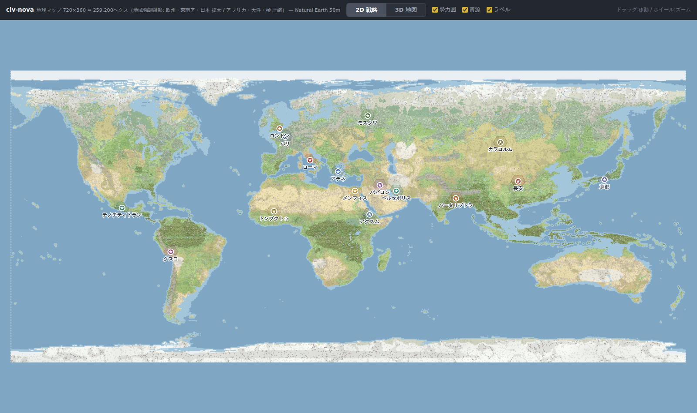

**3D（タイル単位のレリーフ地図・訴求ビュー）— 同じ世界・同じ視点で切替**

3Dの地形は**タイルごとのヘクス角柱（Civ6と同じ発想）**: 各タイルの上面は正六角形の板（コーナーは隣接タイルと共有）、高低差は**ヘクス辺に沿った垂直な崖**、丘/山はタイル内に収まるピラミッド、大陸棚は一段低い六角形の板。**海岸線がジオメトリとテクスチャで1pxもズレない**ので、どのマスが陸でどのマスが海かが3Dでも一意に読める（無段階のなだらかなレリーフ→タイル型ハイトフィールド→ヘクス角柱、と2026-07-02〜03のフィードバックで進化）。フラットシェーディングは法線属性を持たず`dFdx/dFdy`の面法線で行う。

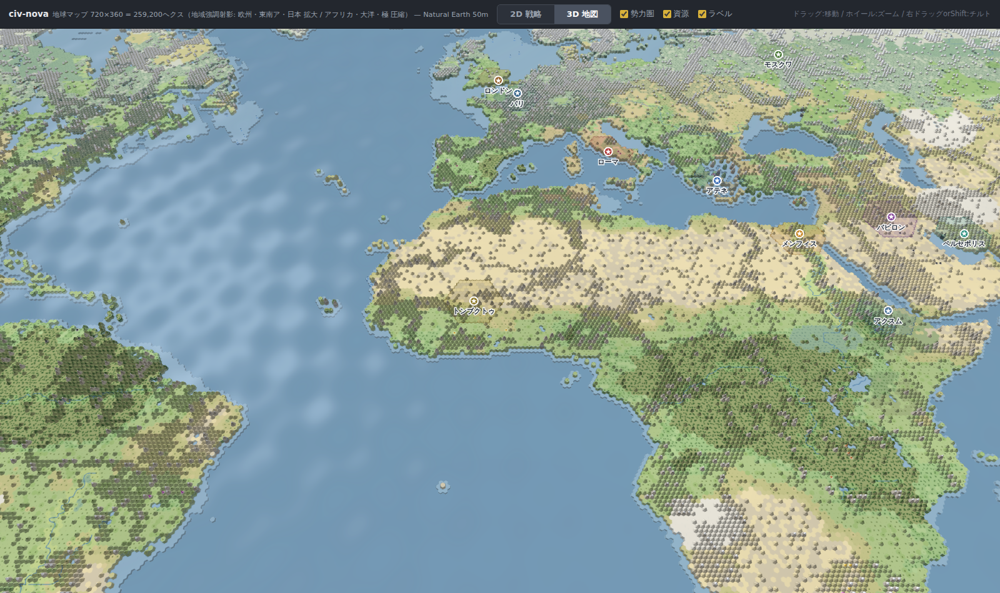

**地中海〜ヨーロッパ（3D）** — アルプスの隆起、ナイルの緑、勢力圏が地形に沿う:

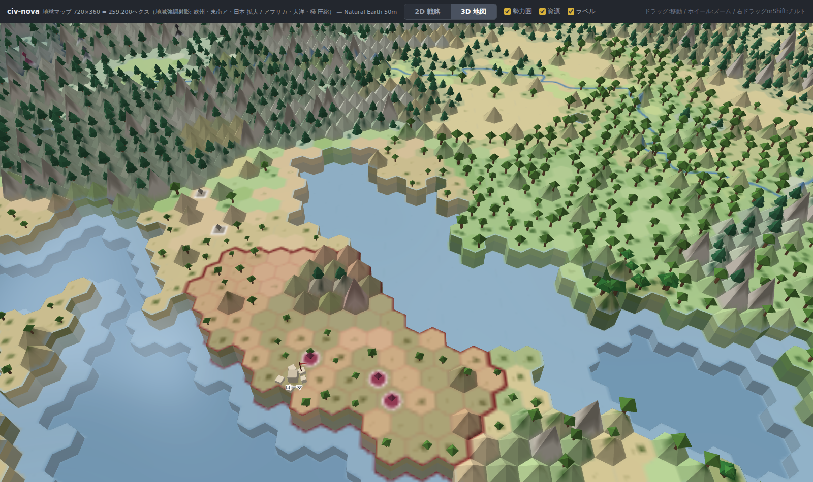

**日本近海（3D）** — 地域強調射影で列島が大きく、浅海の縁取りが走る:

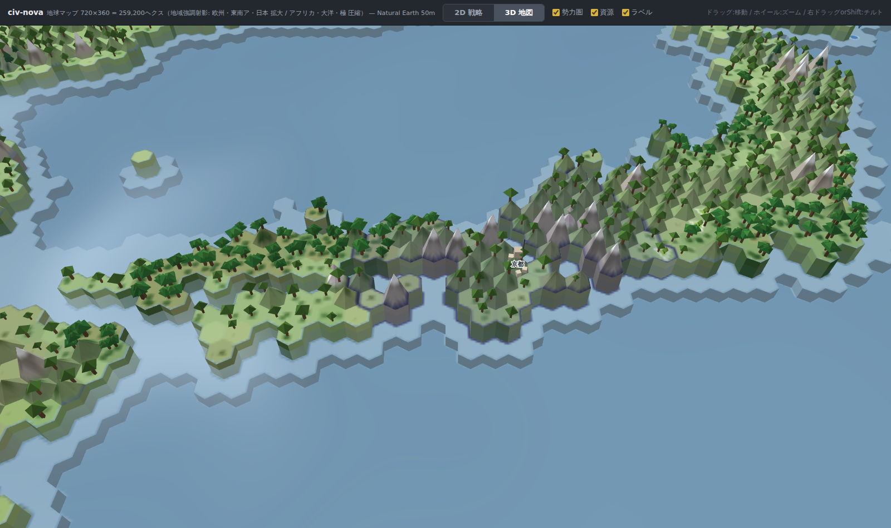

**東南アジア（3D)** — 拡大された群島と熱帯雨林:

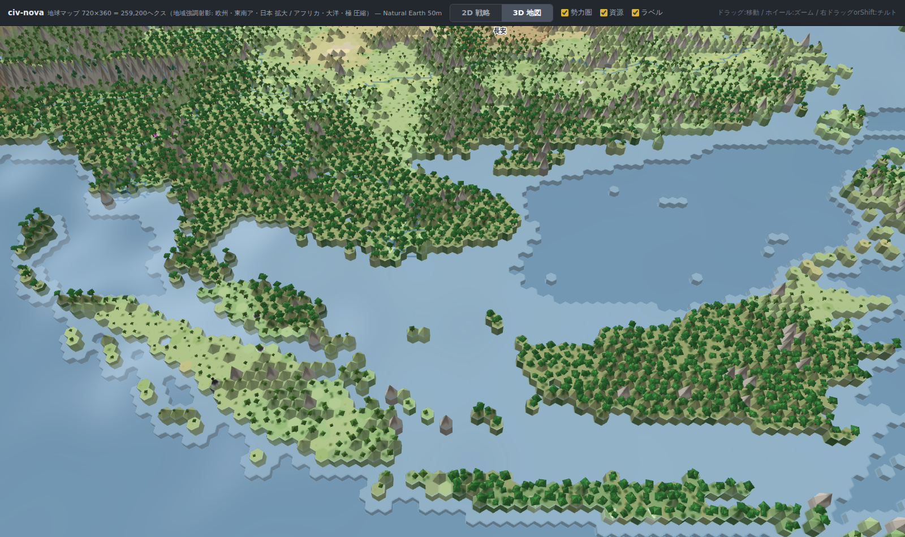

**サヘル〜コンゴ（2D）** — 砂/礫のまだら→サバンナ帯→ラテライト土+熱帯雨林、白ナイルの湿地、西アフリカの金:

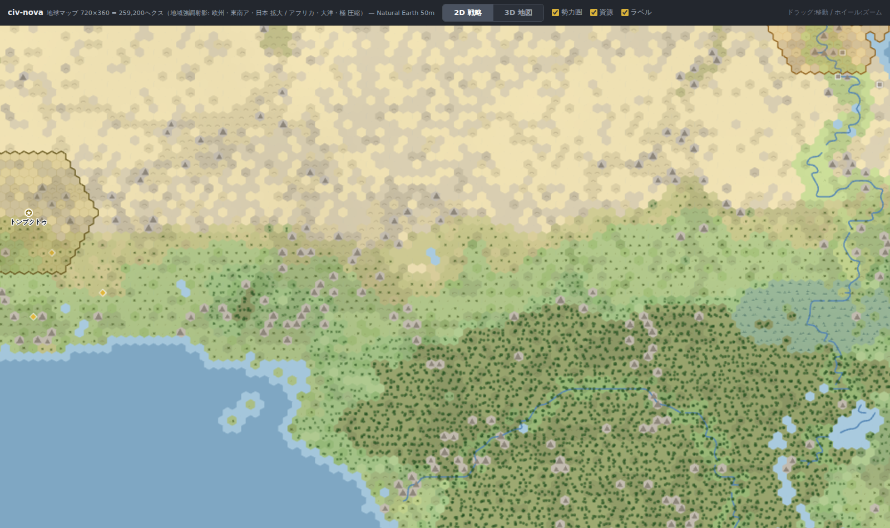

**ヨーロッパ〜ステップ（2D）** — 土壌パッチ（褐色森林土・黒土・レス・ステップ土）と資源アイコン:

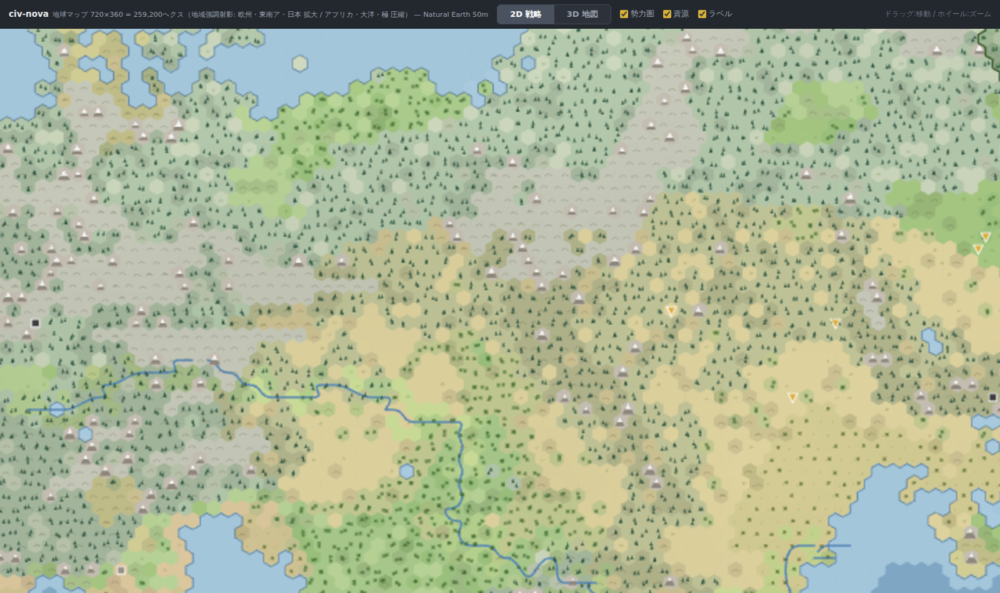

**ヒマラヤ〜インド（3D）** — 山岳タイルが1マスずつ峰として立つ:

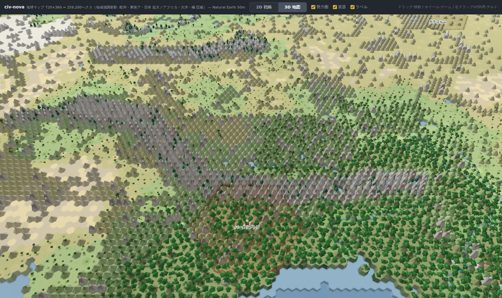

**町のドアップ（3D）** — 家・ホール・文明色の軍旗。木は森林3種で形が違う:

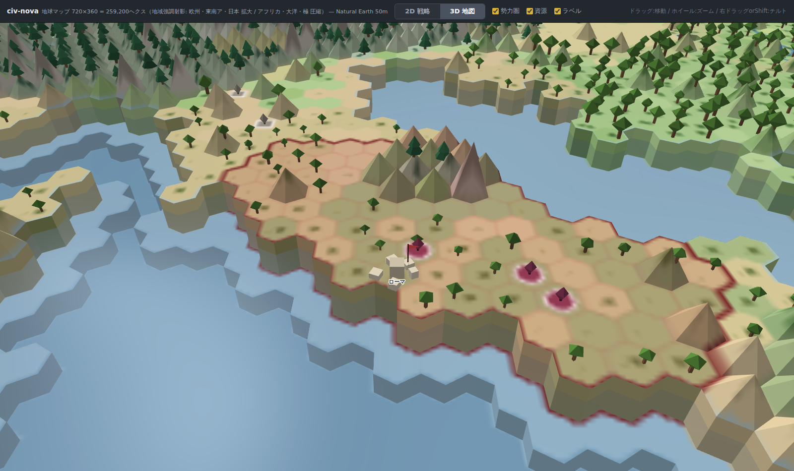

## map-3d-toggle.html — 2D/3D切替の実証

「シム（世界データ）とレンダラを分離すれば、2D/3Dは表示の差し替えになる」ことをコードで実証したもの。3Dは依存ライブラリなしの素のWebGL2（地形メッシュ+ライティング+水シェーダ+フォグ、約500行）で、**2Dのアトラス調テクスチャをそのまま3D地形に貼る**ため両モードの見た目が自動的に一致する。地形ジオメトリはCiv風のタイル単位表現（上記earth-mapと同じ）。

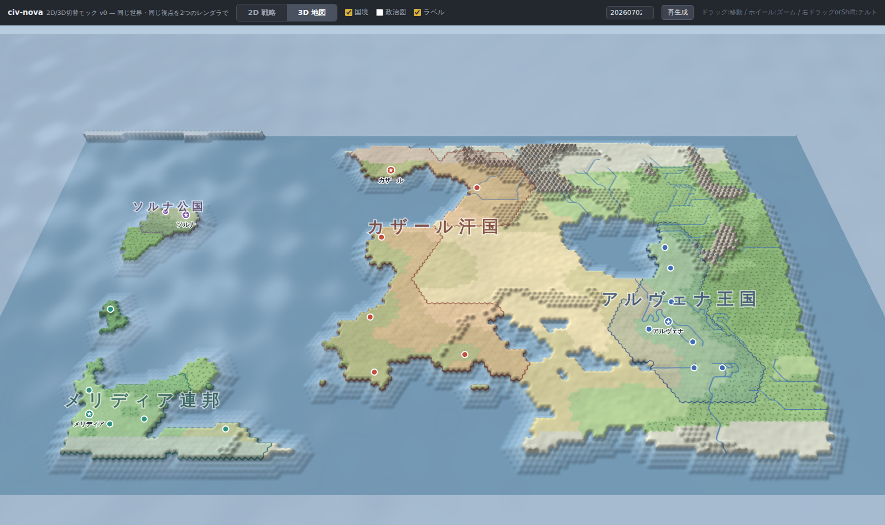

## map-city-mock.html — マップ&都市モック v0

[`map-city-mock.html`](map-city-mock.html) をブラウザで開くだけで動く（依存なし・単一ファイル）。

確認したいことは4つ:

1. **小さなヘクスを大量に敷き詰めた「地球風」マップ**（168×96 ≒ 16,000ヘクス）の上で、**都市が点として置かれる**見た目（ピラー3）
2. 都市間隔に対してタイルが細かいので、**潜在的な都市圏（半径6ヘクス）がとても広い**こと
3. 都市配置の戦略が絵として区別できること。モックでは4カ国 = 4アーキタイプを手続き生成で配置している:
   - **アルヴェナ王国（集積型）** — 肥沃な一帯に8都市を密集。都市圏が重なり合う
   - **カザール汗国（広域支配型）** — 6都市を平均18ヘクス離して置き、大陸の広大な部分を薄く支配
   - **メリディア連邦（ハイブリッド）** — 密集した中核都市群 + 遠隔の辺境都市を1国で併用
   - **ソルナ公国（小国）** — 2都市だけの少数都市経営
4. 都市の中身（専業・都市圏の構成・産出）は**マップに描かずUI側で表現**すること（都市クリックで右パネルに表示）

操作: ドラッグで移動、ホイールでズーム、都市クリックで詳細、右上のシード変更+再生成で別の世界を生成。

### スクリーンショット

**地形図** — 都市は点、地形と資源の偏りが主役:

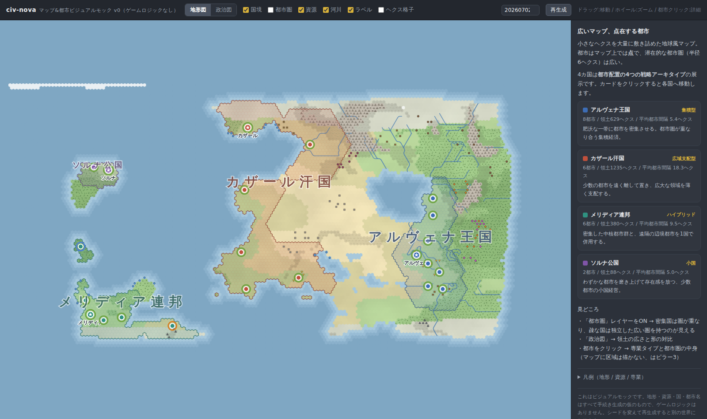

**政治図** — 領土の広さ・形の対比。集積のアルヴェナ（青） vs 広域のカザール（赤）:

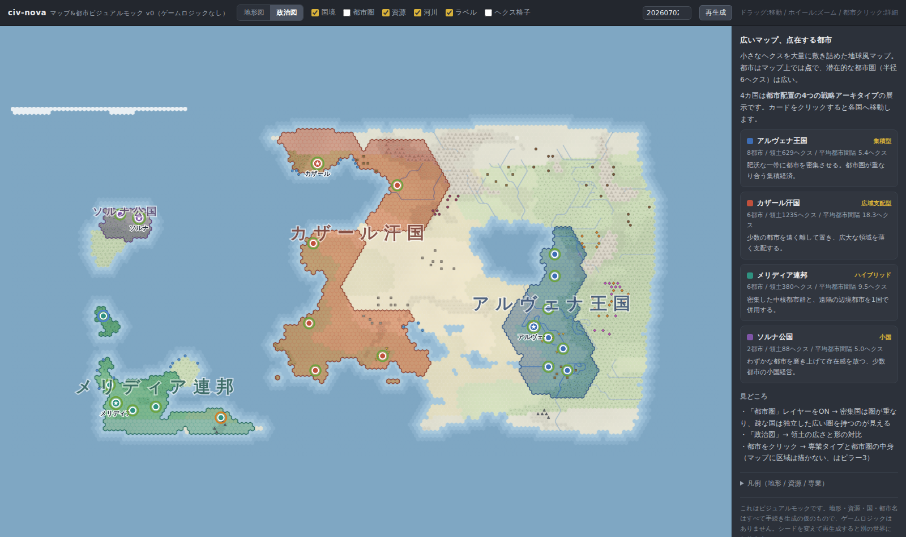

**都市圏レイヤー** — 密集国は圏が重なり、疎な国は独立した広い圏を持つ:

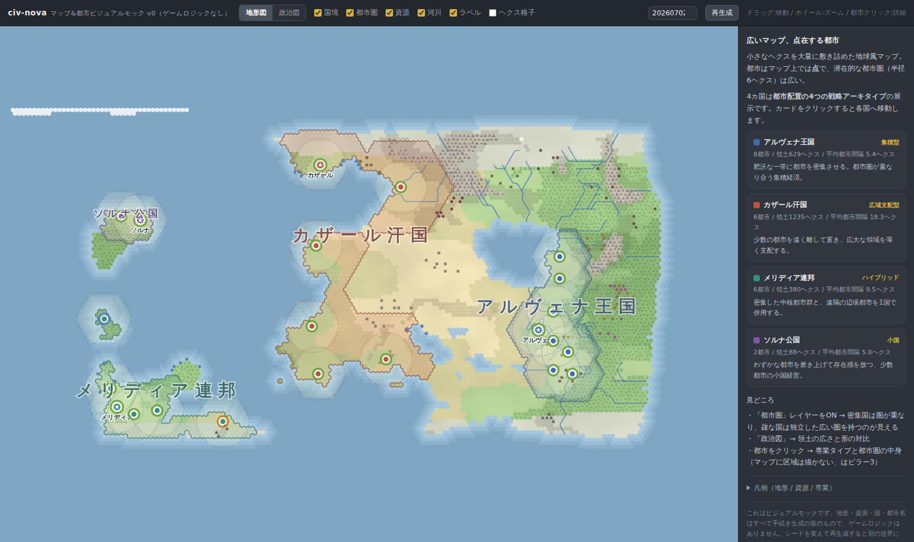

**都市詳細** — 専業タイプ・都市圏の構成・圏内資源はUI側に出す（ピラー3）:

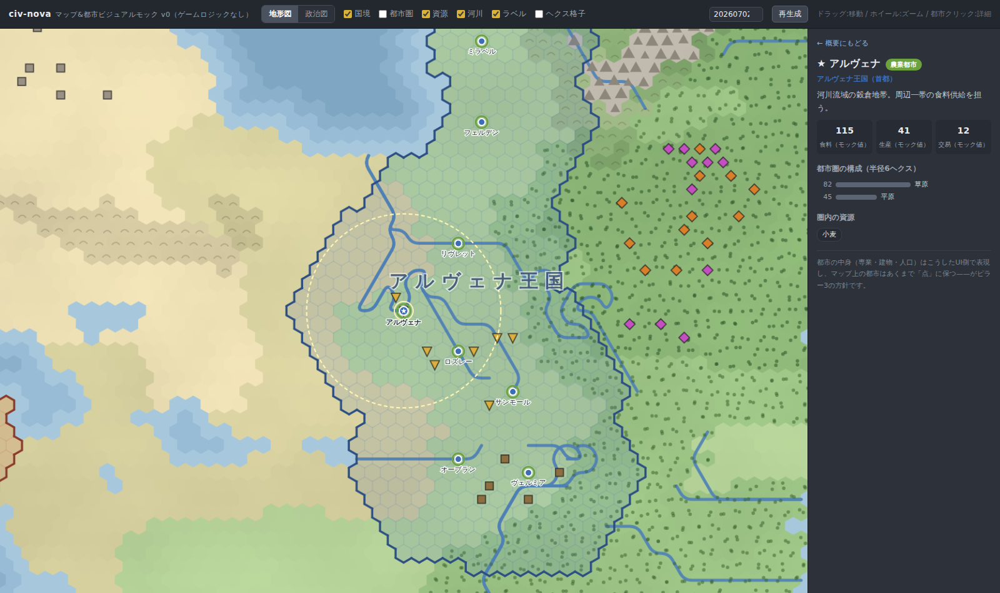

### 実装メモ（モックの中身）

- 手続き生成: fBmノイズ+緯度気候帯で地形、稜線ノイズで山脈、山から海への下り歩きで河川、地域ホットスポット方式で資源を**意図的に偏らせて**配置（ピラー1）
- 都市配置も手続き的（入植スコア + 国ごとの距離制約）なので、シードを変えても4アーキタイプの対比は維持される
- 描画はCanvas 2層（地形の事前レンダ + 動的オーバーレイ）。1.6万ヘクスでもパン/ズームは軽い
- 数値（産出など）はすべて雰囲気用のモック値
